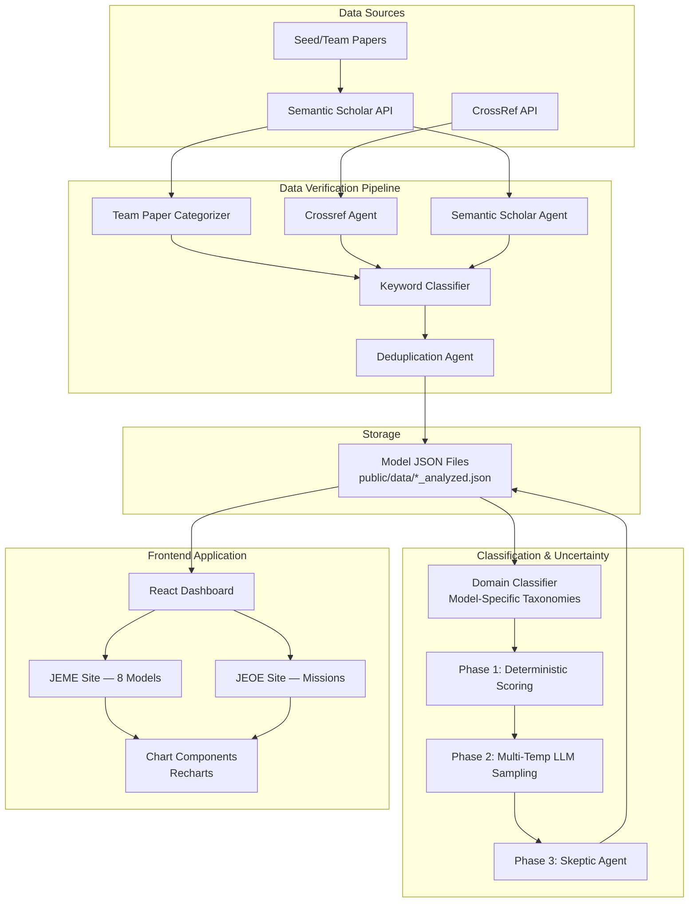
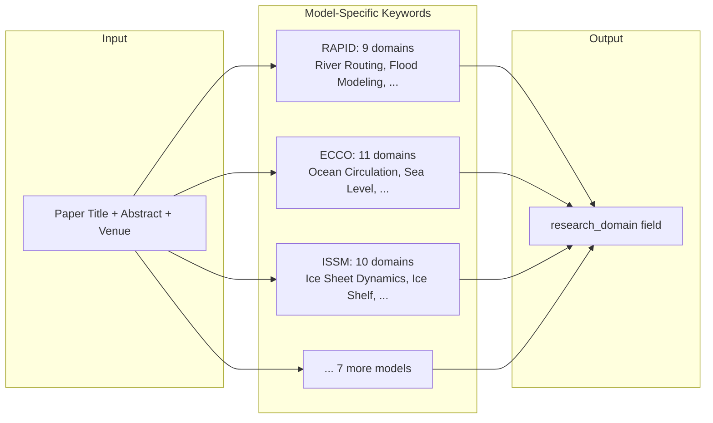
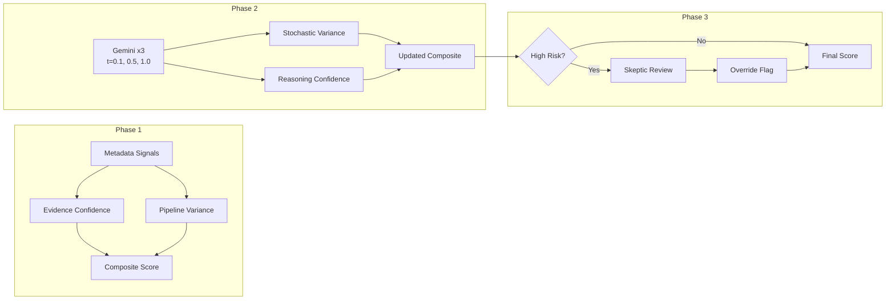
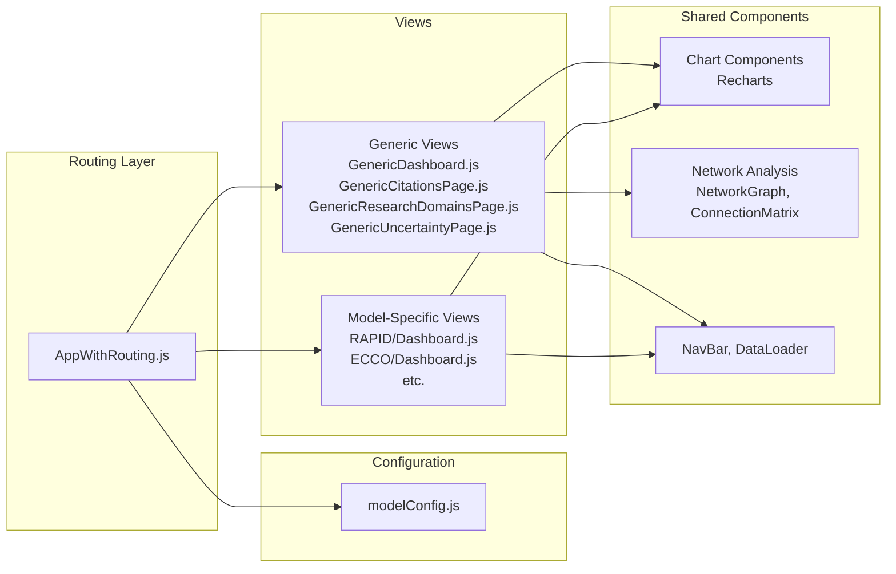

# JPL's Earth Modeling Enterprise (JEME) Dashboard - How It Works

## Summary

The JPL's Earth Modeling Enterprise (JEME) Dashboard is a multi-component system for analyzing and visualizing scientific citation data across JPL Earth science models and NASA missions. It comprises two integrated sites:

- **JEME** — 8 science models: RAPID, CARDAMOM, CMS-Flux, ECCO, ISSM, MOMO-CHEM, LES, EDMF
- **JEOE** (JPL Earth Observation Enterprise) — NASA missions: GRACE, SWOT

The system includes a React-based web dashboard for visualization, a multi-agent data verification pipeline, a keyword-based domain classifier with model-specific taxonomies, and a three-phase uncertainty quantification pipeline using Gemini LLM.

## System Architecture Overview



## Data Collection

Citation data is collected from **Semantic Scholar** using seed (team) papers for each model. A seed paper is a foundational publication that defines, describes, or formally introduces a modeling system. The Semantic Scholar API returns all papers that cite each seed paper, forming the citation corpus.

### Seed Papers

Seed papers (also referred to as team papers) typically include:
1. **Model Development & Description** — Papers presenting the design, formulation, or technical basis of the system.
2. **Core Applications** — Studies that demonstrate the model's capability and serve as reference examples.
3. **Reference Works** — Papers that the broader community consistently cites when applying, validating, or extending the system.

These seed papers form the core bibliography for each model and are prominently featured in the dashboard.

## Multi-Agent Data Verification

A multi-agent pipeline cross-validates citation entries to ensure data quality:

1. **Team Paper Categorizer** — Classifies each team paper by relevance tier (Core > Infrastructure > Data/Methods > Domain Science > Tangential/Unrelated) using hierarchical keyword matching against the team paper title.
2. **Crossref Agent** — Resolves DOIs to validate existence and retrieve journal/venue metadata.
3. **Semantic Scholar Agent** — Batch API for title recovery (broken metadata) and venue enrichment for DOI-less entries.
4. **Keyword Classifier** — Scores citing paper relevance via domain-specific keyword matching on title + abstract.
5. **Deduplication Agent** — DOI-first, title-fallback duplicate detection.

### Verification Outcomes
- **ECCO**: Removed ~3,900 entries (off-topic geodesy, island biogeography, PFAS chemistry); enriched 7,600+ venue fields.
- **ISSM**: Repaired 1,904 broken team paper titles (42 "Untitled"/truncated IDs resolved via Semantic Scholar).
- **All other models**: Verified clean (91-96% keyword relevance match).

### Data Cleaning

A supplementary cleaning script (`scripts/clean_citation_data.js`) removes spam and metadata noise from citation JSON files. Three filter categories:
1. "Review of:" spam entries (auto-generated nano-electronics papers)
2. Placeholder/corrupted entries ("Insight Review Articles", "Digital Commons", etc.)
3. Supplementary material/metadata (interactive comments, printer-friendly versions)

## Research Domain Classification

### Model-Specific Taxonomies

Each model has a tailored set of 7-11 research domain categories with domain-specific keyword dictionaries, replacing the original shared 11-category generic taxonomy. This produces far more meaningful classification — for example, ECCO papers are classified into "Ocean Circulation & Transport", "Sea Level Change & Variability", and "Mesoscale & Submesoscale Dynamics" rather than a single "Ocean & Marine Science" bucket.



#### Model Domain Taxonomies

**RAPID** (river routing): River Routing & Discharge, Flood Modeling & Prediction, Watershed & Catchment Hydrology, Water Resource Management, Groundwater & Aquifer, Remote Sensing Applications, Machine Learning for Hydrology, Climate & Water Cycle, General Hydrologic Science

**CARDAMOM** (carbon data-model): Terrestrial Carbon Cycle, Vegetation & Forest Dynamics, Soil & Peatland Carbon, Fire & Disturbance Ecology, Land Use & Land Cover Change, Carbon Data Assimilation, Arctic & Permafrost Carbon, Remote Sensing of Ecosystems, Climate Projections & Feedbacks, General Science

**CMS-Flux** (carbon monitoring): CO2 Flux & Carbon Budget, Atmospheric CO2 Inversions, Ocean Carbon Uptake, Fossil Fuel & Urban Emissions, Land-Atmosphere Exchange, Methane & Trace Gases, Biomass & Fire Emissions, Satellite Carbon Observations, Carbon Cycle Modeling, General Science

**ECCO** (ocean circulation): Ocean Circulation & Transport, Sea Level Change & Variability, Mesoscale & Submesoscale Dynamics, Ocean Heat & Energy Budget, Arctic & Polar Ocean, Coastal & Regional Ocean, Marine Biogeochemistry, Ocean-Ice Interaction, Satellite Oceanography, Ocean Modeling & Data Assimilation, General Science

**EDMF** (boundary layer): Boundary Layer Turbulence, Convection & Cloud Processes, Weather Prediction & NWP, Air Quality & Pollution, Aerosol & Radiation, Tropical Cyclones & Storms, Parameterization Development, General Atmospheric Science

**ISSM** (ice sheet model): Ice Sheet Dynamics & Flow, Ice Shelf & Calving, Glacier Retreat & Mass Balance, Sea Level Contribution, Subglacial & Basal Processes, Polar Ocean & Ice-Ocean Interaction, Snow & Firn Processes, Remote Sensing of Ice, Ice Sheet Modeling & Methods, General Science

**LES** (large eddy simulation): Cloud & Stratocumulus Simulation, Boundary Layer Turbulence, Methane Detection & Plumes, Fire & Smoke Modeling, Atmospheric Chemistry LES, Wind & Urban Applications, Remote Sensing & AI Methods, General Science

**MOMO-CHEM** (atmospheric chemistry): Ozone & Stratospheric Chemistry, Aerosol Processes & Effects, Air Quality & Health, Methane & Trace Gases, Chemical Transport Modeling, Wildfire & Biomass Burning, Satellite Atmospheric Observations, Climate-Chemistry Interactions, General Science

**GRACE** (gravity mission): Terrestrial Water Storage, Groundwater Depletion, Ice Mass Balance, Ocean Mass & Sea Level, Gravity Field & Geodesy, Drought & Flood Detection, River Basin Hydrology, GRACE Instrument & Methods, General Science

**SWOT** (surface water/ocean topography): River & Lake Monitoring, Flood Mapping & Detection, Ocean Surface Topography, Coastal & Estuarine Dynamics, Altimetry Methods & Calibration, Reservoir & Water Management, Bathymetry & Seafloor, General Science

### Engagement Level Classification

Each citation is also classified by how deeply it engages with the cited model:

- **Level 1: Acknowledgement Citation** — The work is mentioned only as background or context without using its data, methods, or results.
- **Level 2: Data/Method Usage** — The work's data, tools, or methods are applied as-is without modification.
- **Level 3: Model/Method Adaptation** — The work's approach is adapted, modified, or improved for new purposes.
- **Level 4: Foundational Method** — The cited work provides a conceptual or methodological foundation central to the citing research.

## Uncertainty Quantification

The dashboard includes a three-phase uncertainty quantification pipeline that measures confidence in each citation's automated classification.

### Phase 1: Deterministic Scoring

Every citation entry receives an uncertainty score computed purely from metadata signals — no LLM API calls required.

- **Evidence Confidence** (0-1): Weighted sum of data completeness signals — has abstract (35%), has DOI (15%), has venue (15%), has full authors (10%), and domain keyword match score (25%).
- **Pipeline Variance** (0-1): Measures disagreement between the keyword-based classifier and LLM (Gemini) labels. Domain mismatch adds 0.5, engagement level mismatch adds 0.5.
- **Reasoning Confidence**: Heuristic proxy — 0.85 when an abstract is available, 0.5 without (title-only classification is less reliable).
- **Composite Confidence**: `0.45 * evidence + 0.45 * reasoning - 0.10 * pipeline_variance`, clamped to [5%, 99%].
- **Miscalibration Risk**: Flags entries at risk of systematic error (no abstract + high pipeline variance = "high" risk).

### Phase 2: Multi-Temperature LLM Sampling

For each entry, the system calls Gemini three times at different temperatures (0.1, 0.5, 1.0) and asks it to classify the engagement level, research domain (using the model-specific taxonomy), and self-assess its confidence.

- **Stochastic Variance** (0.0-0.67): Fraction of runs that disagree with the majority label. 0.0 means all three runs agree (high reliability), 0.67 means all three gave different answers (low reliability).
- **Reasoning Confidence**: Average of Gemini's self-assessed confidence across runs, normalized from a 1-5 scale to 0-1.
- **Updated Composite**: When Phase 2 data is available, the formula shifts to reward agreement: `0.35 * evidence + 0.35 * reasoning + 0.20 * (1 - stochastic_variance) - 0.10 * pipeline_variance`.

### Phase 3: Skeptic Agent

A final adversarial review targets the highest-risk entries — typically 10-20% of the total — where classifications are least certain:

- Entries with high miscalibration risk
- Entries with stochastic variance above 0.3
- Entries classified at high engagement (Level 3-4) but with composite confidence below 0.5

For each flagged entry, a skeptic prompt asks Gemini to *challenge* the existing classification and rate its agreement (1-5). If the skeptic strongly disagrees (agreement <= 2/5), an override flag is set, alerting reviewers that the entry's classification may need manual correction.



### Uncertainty Dashboard

Each model's uncertainty analysis is available at `/{modelName}/uncertainty`. The page displays:
- Composite confidence distribution and averages
- Evidence vs reasoning confidence matrix
- Confidence breakdown by engagement level and research domain
- Evidence gaps analysis
- Stochastic variance distribution (when Phase 2 data is available)
- Skeptic review summary and override-flagged entries (when Phase 3 data is available)

## Network Analysis

The main dashboard includes a cross-model connectivity analysis that identifies relationships between models through shared citations:

- **Bridge Papers**: Publications cited by multiple models, revealing cross-disciplinary connections.
- **Connection Matrix**: Pairwise connectivity between all models based on shared papers.
- **Cross-Model Authors**: Researchers who contribute to multiple model communities.
- **Domain Overlap**: Shared research domains across models.

## Dashboard Architecture

### JEME/JEOE Dual-Site Design

The dashboard operates as two context-aware sites with shared infrastructure:

- **JEME** (`/science-model-dashboard/`) — 8 science models with model-specific dashboards, citations pages, geographic impact, research domains, and uncertainty analysis.
- **JEOE** (`/science-model-dashboard/JEOE`) — NASA missions (GRACE, SWOT) with mission-specific dashboards and the same analytics pages.

The NavBar, logo, title, subtitle, favicon, and browser tab title all swap dynamically based on context.

### Component Architecture



### Routing

```
/science-model-dashboard                          → JEME main dashboard (8 models)
/science-model-dashboard/JEOE                     → JEOE main dashboard (missions)
/science-model-dashboard/{modelName}              → Model/mission dashboard
/science-model-dashboard/{modelName}/citations    → Citations page
/science-model-dashboard/{modelName}/geographic-impact → Geographic analysis
/science-model-dashboard/{modelName}/research-domains  → Research domains
/science-model-dashboard/{modelName}/uncertainty  → Uncertainty analysis
/science-model-dashboard/how-it-works             → This page
```

### Data Flow

Each model's data is stored as a JSON file (`public/data/{MODEL_NAME}_analyzed.json`) containing citation entries in a standardized format with fields including title, authors, year, DOI, abstract, venue, citation count, research domain, engagement level, and uncertainty scores.

The frontend loads these files dynamically and processes them client-side using utility functions in `dataUtils.js` that normalize differences between Crossref and Semantic Scholar data formats.

## Technical Stack

### Frontend
- **Framework**: React 18.x with Create React App
- **Routing**: React Router v6
- **Styling**: Tailwind CSS
- **Charts**: Recharts
- **Maps**: D3 + TopoJSON
- **Icons**: Lucide React
- **Diagrams**: Mermaid.js

### Processing Pipeline
- **Language**: Python 3
- **LLM Integration**: Google Gemini API (Phase 2 & 3)
- **Data Sources**: Semantic Scholar API, CrossRef API
- **Classification**: Keyword-based with model-specific taxonomies
- **Data Format**: JSON files

### Deployment
- **Production**: `http://34.31.165.25:3000/science-model-dashboard/`
- **Server**: Node.js serving the built React application
- **Data Processing**: Local Python scripts run offline to generate/update JSON data files

## Data Pipeline Commands

```
# Classification
python scripts/classify_papers.py --model RAPID       # Classify one model
python scripts/classify_papers.py --all                # Classify all models

# Uncertainty quantification
python scripts/compute_uncertainty.py --model RAPID    # Phase 1 deterministic
python scripts/phase2_llm_confidence.py --model RAPID  # Phase 2 LLM sampling
python scripts/phase3_skeptic_agent.py --model RAPID   # Phase 3 skeptic review

# Data cleaning
node scripts/clean_citation_data.js --all --dry-run    # Preview cleanup
node scripts/clean_citation_data.js --model ECCO       # Clean specific model
```

## Conclusion

The JEME/JEOE Dashboard provides a comprehensive solution for scientific citation analysis across JPL's Earth science modeling portfolio. It combines automated keyword classification with model-specific domain taxonomies, multi-phase uncertainty quantification using Gemini LLM, and cross-model network analysis — all presented through an interactive React dashboard serving both the modeling and mission observation communities.
